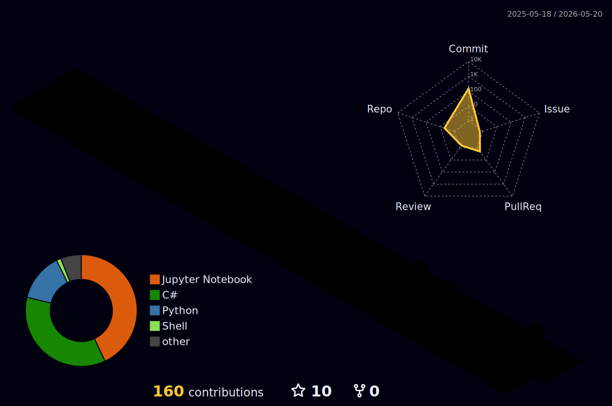

## Guten Tag! 👋

I'm **Joshua**, a Developer trainee specializing in Application Development at BITLC GmbH. With a diverse background that touches on engineering, CAD design, and IT, I bring a strong analytical and hands-on approach to software development and systems administration.

Beyond coding, I'm passionate about electronics, amateur radio, 3D modelling, and networking.

## Skills & Profile:

| | | |
|---|---|---|
| **Languages** | C, C#, Python, HTML, SQL, Pascal |  |
| **Frameworks** | Angular, ASP.NET |  |
| **Software** | Visual Studio, PowerShell, AutoCAD, MS SQL Server |  |
| **Operating Systems**| Windows, Linux (LPIC-1 Certified) |  |
| **Spoken Languages** | German (Native), English (C2) | 🇩🇪 🇬🇧 |
| **Where to find me** | [Github](https://github.com/J-Moessmer), [Linkedin](https://www.linkedin.com/in/joshua-moessmer/) |  |

<!--
**j-moessmer** is a ✨ _special_ ✨ repository because its `README.md` (this file) appears on your GitHub profile.

Here are some ideas to get you started:

- 🔭 I’m currently working on ...
- 🌱 I’m currently learning ...
- 👯 I’m looking to collaborate on ...
- 🤔 I’m looking for help with ...
- 💬 Ask me about ...
- 📫 How to reach me: ...
- 😄 Pronouns: ...
- ⚡ Fun fact: ...
-->

## GitHub Stats

  

  

